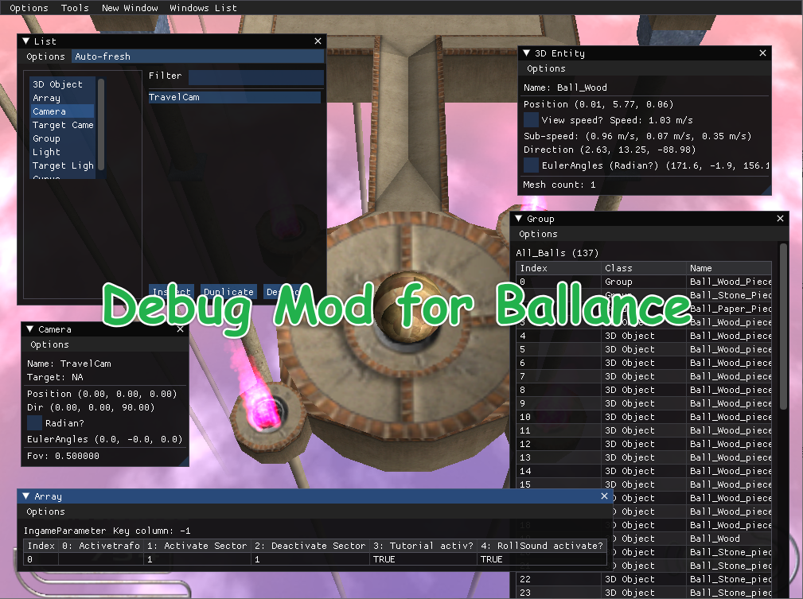
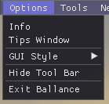
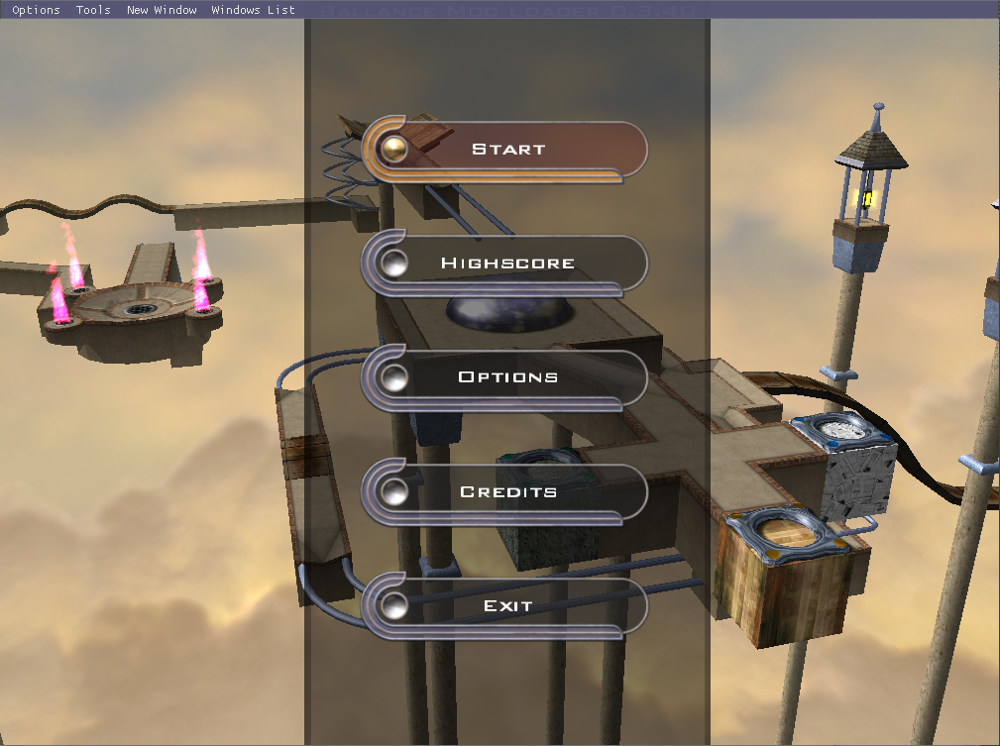
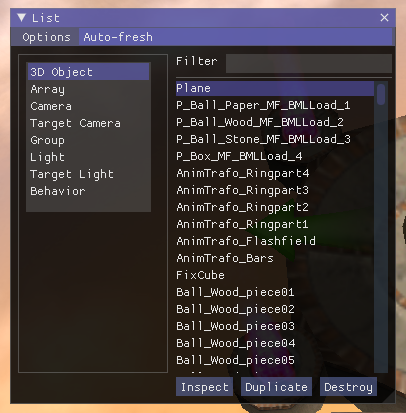
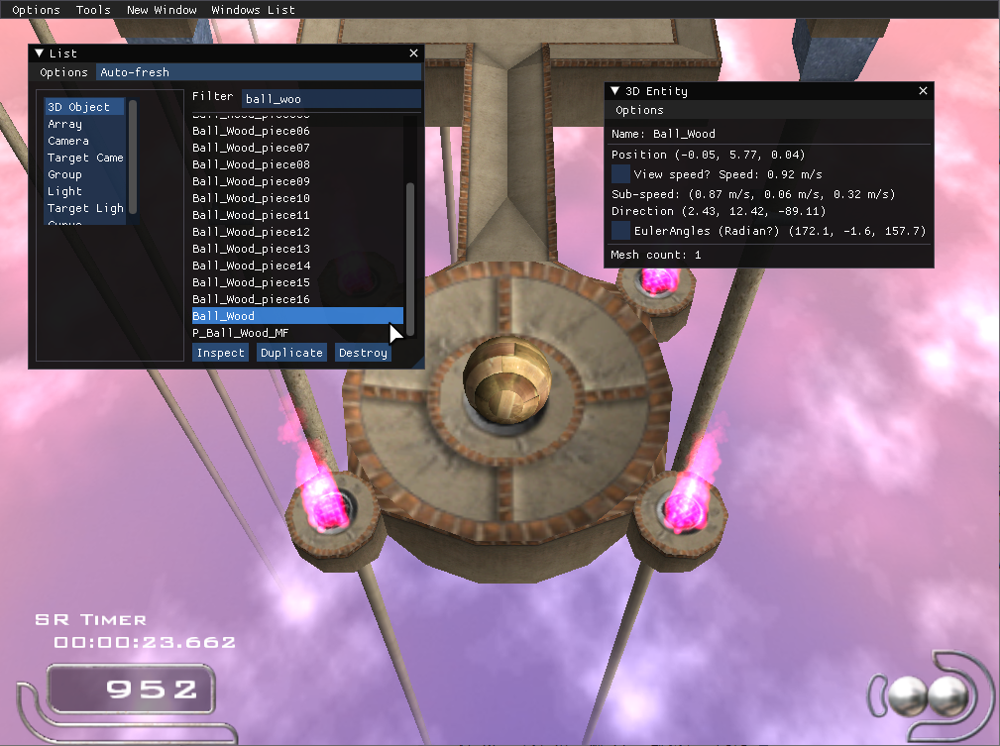
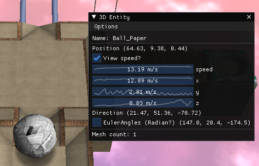
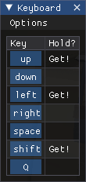
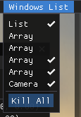
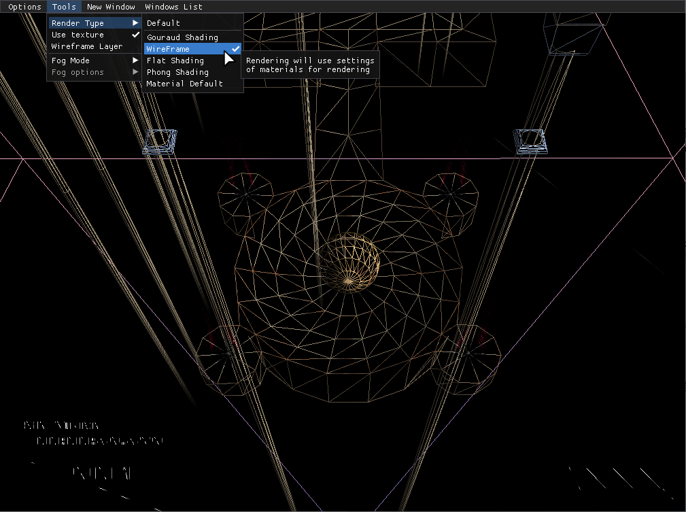
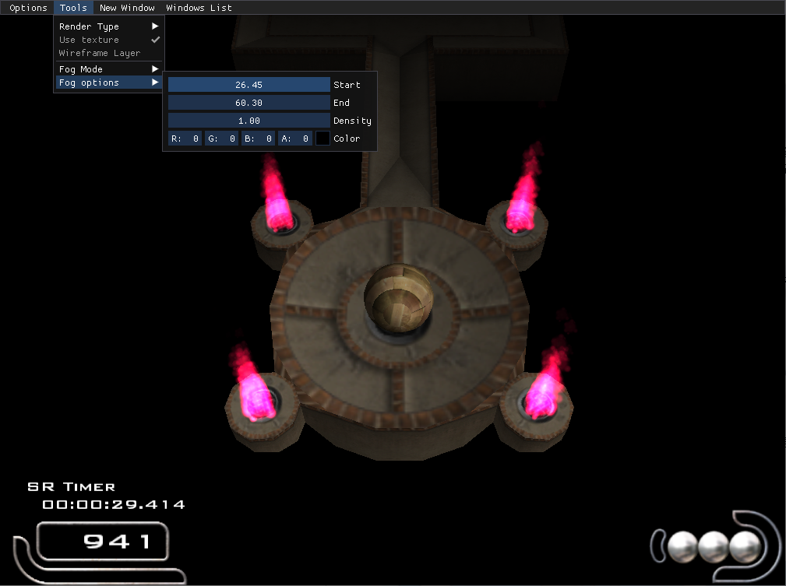

# Debug Mod for Ballance

这是一个用于 [Ballance](https://ballance.jxpxxzj.cn) 的 Debug Mod，能够在游戏界面中叠加渲染显示实时游戏内数据。对于 Ballance 制图、竞速、tas、mod 编写等均有一定帮助。

## 依赖

直接使用 dev 包：

-   [BallanceModLoader](https://github.com/Gamepiaynmo/BallanceModLoader/releases)

Submodules：

-   [ocornut/imgui](https://github.com/ocornut/imgui)
-   [Rebzzel/kiero](https://github.com/Rebzzel/kiero)

## 如何启用

第一次使用见不到全局主菜单是正常现象。Ballance 使用的是 DirectX 8，而 kiero 和 imgui 最低支持为 DirectX 9，所以需要先进行转换。这里使用 [enbconvertor](http://enbdev.com) 进行转换。

在游戏中输入指令 `/setup_imgui_lib` 后，显示成功并重启游戏即可生效。若失败可尝试将[此目录](./DebugMod/d3d8/)下的所有文件直接放入 `Ballance根目录/bin/` 文件夹下，并重启游戏。

## 功能

### 全局菜单

一个全局存在的主菜单，显示在窗口最上方，包含了绝大部分的功能、选项，可调整 imgui 主题， ~~秒退游戏等~~ 等。

此功能默认全局打开。可在 Options - Hide Tool Bar 关闭。

### 物件列表

一个显示当前游戏内大部分物件的窗口。在 New Window - List 打开。

以物件的类查看列表，双击右侧列表的物件可打开对应的物件监视窗口。

右侧下方的按钮可以监视（Inspect，与双击物件用处一样）、复制（Duplicate）、销毁（Destroy），目标为列表中被选中的物件。

### 物件监视窗口

以窗口的形式监视物件的部分数据。如 3D Object 可显示线速度、坐标、角速度、朝向等信息。

目前支持监视的类型：

-   3D Object
-   Array
-   (Target) Camera
-   Group
-   (Target) Light

### 按键监视窗口

以窗口的形式监视实时按键信息。在 New Window - Keyboard 打开。

分为两种类型：Ballance 全部按键（Default），仅监视方向键（Arrows-only）。

### 窗口列表

即主菜单的 Windows List。该选项显示当前所有被开启的窗口，**注意窗口右上角的小'×'仅隐藏窗口**，可在 Windows List 中再次打开。亦可右键关闭防止内存占用 ~~（其实一般情况下并不会占用很多内存）~~ ，Kill All 可一次性关闭所有窗口。

### 辅助工具

**Debug Mod 并非作为一种作弊工具而被开发**，辅助工具并不能直接对游戏进行作弊操作（如起飞、直接通关等）。此处辅助工具一般为渲染、调试相关，目前可用功能如下：

-   渲染模式设置（线框模式、无材质模式等）
    
-   雾设置（仅黑色不会使游戏透明材质出错）
    

## 指令

基本上所有功能都内置到 gui 了，故指令暂不介绍 ~~（其实就是懒得写了~~

## 后续开发计划

后期可能加入对数据的直接修改功能，以满足 Debug Mod 性质，更加方便地进行游戏内代码/路线调试。

-   数据修改功能
-   球轨迹显示
-   变球器无判定的测试模式（显示变球器检测范围）
-   命令形式的自定义监视
